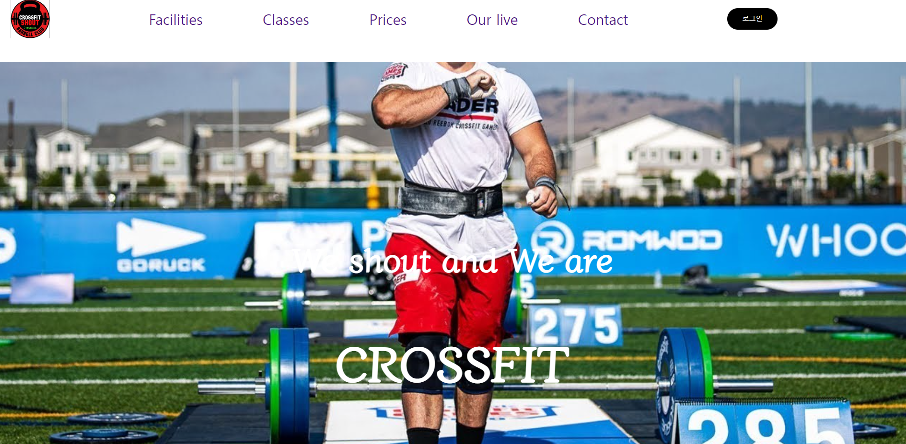
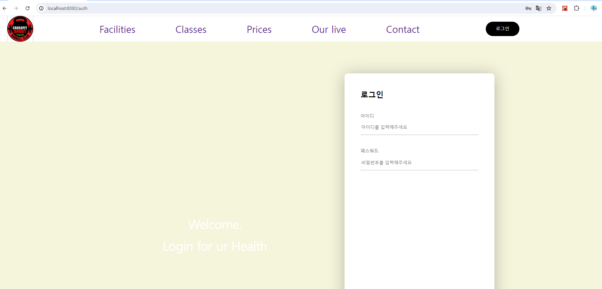

# 상용화목적 프로젝트
여러운동 종목중 하나인 Crossfit을 겨냥한 웹,앱 개발. 체인점들을 위한 요금정산, 광고대행의 목적이 아닌 염두해 둔 특성을 가지고 있는 크로스핏 박스를 상대로 상용화한다. 

# 상용화될 가능성 있는 프로젝트의 기능적 특성
1. ChatRoom개설. 개인운동이 아닌 공동운동의 성향이 강한 크로스핏의 특성과 박스 나름의 특징을 살려 회원들간의 bondage향상. 

1. 그날그날의 WOD를 채팅창에 업로드한다(크로스핏만의 특징으로 먼저 앱상으로 방문하고 오늘의 WOD가 기호에 맞는지 아닌지에 따라 회원이 출석여부 미리 결정할수 있는 기회 제공). 이 기능이면 카톡으로 유저들 넘어가지 못하게 잡을 수 있다?

1. 시간대별 클래스당 참여인원 공개기능. 공동운동? 본래 운동의 취지보다는 어떤 크루가 참여하나에 관심 많은10,20대, 대중적 관심. 수업 스캐줄 혹은 자유단체 운동에서의 회원 프로필 공개

# 팀원 소개 
김효진(기여도 100%)

# 역할
DB설계, API명세서 설계, Figma 디자인, FrontEnd page randering, Routing, MVC Pattern design, Server design, BearerToken, JWT사용

# 사용기술
 #### `Back-end`
  - Java 
  - Spring Boot 
  - Gradle
  - Spring Data JPA
  - MySQL
  - Spring Security
  - 
#### `Front-end`
  - React
  - Javascript
  - CSS
  - HTML
  - XHR
  - TSX
  - TypeScript

# DB구성 쿼리 
- 
# 코드참조
- [Sourcecode.txt](https://github.com/dhflekddy/MYWorkoutProject)
  
# 결과 이미지
  

# License
- [Explenation for license later](LICENSE)